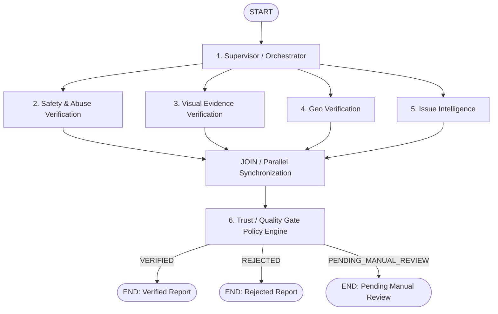

# System Architecture

> This document describes the overall technical architecture of CivicConnect.
>
> It serves as the primary architectural reference for developers and autonomous coding agents.
>
> Detailed implementation specifications are located under `docs/specs/`.

---

# Overview

CivicConnect is a production-grade civic engagement platform that enables citizens to report municipal issues through a mobile application while using AI agents to validate, classify, enrich, and route reports to the appropriate government department.

The platform follows a layered architecture with event-driven processing for long-running AI workloads.

---

# High-Level Architecture

```
                    Citizens
                        │
                        ▼
          React Native Mobile Application
                        │
                HTTPS / WebSocket
                        │
                        ▼
                  FastAPI Backend
                        │
        ┌───────────────┴────────────────┐
        │                                │
        ▼                                ▼
 PostgreSQL + PostGIS             Redis + Celery
        │                                │
        └───────────────┬────────────────┘
                        │
                        ▼
               Phase-1 LangGraph Verification Engine
                        │
      ┌─────────────────────────────────────────────────┐
      │ Supervisor / Orchestrator                       │
      │                                                 │
      │   ├── 1. Safety & Abuse Verification            │
      │   ├── 2. Visual Evidence Verification           │
      │   ├── 3. Geo Verification                       │
      │   └── 4. Issue Intelligence                     │
      │                                                 │
      │   ──► 5. Trust / Quality Gate Policy Engine     │
      └─────────────────────────────────────────────────┘
                        │
                        ▼
      Output Decision (VERIFIED / REJECTED / REVIEW)

        Cloudinary
        NVIDIA NIM
        OpenRouter
        Firebase Cloud Messaging
        SMS Provider
        Email Provider
```

---

# Architectural Principles

The system is designed around the following principles.

## Separation of Concerns

Each layer has a single responsibility.

- Mobile handles presentation.
- Backend exposes APIs.
- Services contain business logic.
- Agents perform AI reasoning.
- Database stores persistent data.
- Infrastructure integrates external systems.

---

## Layered Architecture

```
Presentation

↓

API

↓

Application

↓

Domain

↓

Infrastructure
```

Each layer depends only on the layer beneath it.

---

## Event-Driven Processing

Heavy operations are executed asynchronously.

Examples

- AI image analysis
- LLM classification
- Notifications
- Email delivery
- SMS delivery
- Audit logging

Redis and Celery coordinate background processing.

---

# Mobile Architecture

Technology

- React Native
- Expo
- expo-router
- Zustand
- React Query
- i18next

Responsibilities

- Authentication
- Report creation
- Report tracking
- Offline support
- Push notifications
- Localization

The mobile application never communicates directly with external services.

All requests pass through the backend API.

---

# Backend Architecture

Technology

- FastAPI
- SQLAlchemy
- Pydantic
- Alembic

Responsibilities

- Authentication
- Authorization
- Validation
- Business logic
- Agent orchestration
- Database access
- API documentation

Business logic must never exist inside API route handlers.

---

# AI Architecture

The CivicConnect AI processing system uses LangGraph for multi-agent workflow orchestration.

### Architectural Evolution Notice
- **Current Legacy Implementation** (`backend/agents/pipeline.py`): Runs an 8-node workflow with downstream Enhancer, Router, and Notifier nodes inside the graph, followed by an imperative Quality Gate policy check outside the graph.
- **Target Phase-1 Refactor Architecture**: Refactors the graph into a dedicated **Phase-1 Report Verification Engine** comprising 6 logical components with an **in-graph Trust / Quality Gate** decision node. Downstream operations (Incident Intelligence, Routing, Notifications) are separated into subsequent phases.

---

### Target Phase-1 Graph Architecture Diagram



---

### Phase-1 Component Summary

1. **Supervisor / Orchestrator**: State preparation, text normalization, PII sanitization, and parallel execution startup.
2. **Safety & Abuse Verification**: Defense against profanity, toxicity, spam, and prompt/instruction injections (Citizen text is treated strictly as **UNTRUSTED DATA**).
3. **Visual Evidence Verification**: Dual-layer analysis (Visual Understanding + Technical/Forensic Signals) covering camera photos, screenshots, photo-of-screen, AI-generated images, manipulated media, and perceptual hash duplicates (Citizen images are treated strictly as **UNTRUSTED EVIDENCE**).
4. **Geo Verification**: Deterministic PostGIS `ST_Covers` spatial boundary checks against PMC ward geometries.
5. **Issue Intelligence**: Multilingual classification of PMC category, urgency, tags, and public safety risk.
6. **Trust / Quality Gate**: Deterministic policy engine running **inside** the graph to produce a final `VERIFIED`, `REJECTED`, or `PENDING_MANUAL_REVIEW` outcome.


---

# Database Architecture

Technology

- PostgreSQL
- PostGIS

Database responsibilities

- Citizens
- Reports
- Photos
- Departments
- Wards
- Rewards
- Agent execution history
- Status logs

Every table uses UUID primary keys.

Spatial operations use PostGIS.

---

# Infrastructure Architecture

Infrastructure includes

- Docker
- Redis
- Celery
- Cloudinary
- Firebase Cloud Messaging
- Email provider
- SMS provider

Infrastructure services are accessed only through dedicated service modules.

---

# External Integrations

## Cloudinary

Responsibilities

- Image storage
- Image optimization
- CDN delivery

---

## NVIDIA NIM

Responsibilities

- Language reasoning
- Classification
- Summarization

---

## OpenRouter

Responsibilities

Fallback LLM provider.

---

## Firebase Cloud Messaging

Responsibilities

Push notifications.

---

## SMS Provider

Responsibilities

OTP delivery.

---

## Email Provider

Responsibilities

Transactional emails.

---

# Data Flow

Citizen submits report
        │
        ▼
FastAPI validates request
        │
        ▼
Report persisted in DB (status: PENDING)
        │
        ▼
Background verification task enqueued
        │
        ▼
Phase-1 Report Verification Engine
        │
        ▼
Supervisor prepares state & AI-safe representation
        │
        ▼
Parallel Verification
  (Safety & Abuse, Visual Evidence, Geo, Issue Intelligence)
        │
        ▼
Trust / Quality Gate Policy Engine
        │
        ▼
Verification Decision Emitted
  (VERIFIED / REJECTED / PENDING_MANUAL_REVIEW)
        │
        ▼
Phase 1 Ends (Verified Report created)
        │
     (Future)
        │
        ▼
Future Phase 2: Incident Intelligence (Spatial Candidate Search, Similarity & Corroboration)
        │
        ▼
Future Phase 3: Municipal Action (Smart Routing, SLA, Notifications)
```


---

# Security Architecture

Authentication

JWT access tokens

JWT refresh tokens

Password hashing

bcrypt

Authorization

Role-based permissions.

Validation

All incoming data is validated using Pydantic.

Secrets

Secrets are never stored in source control.

---

# Error Handling

Every layer must

- return structured errors
- log failures
- preserve audit history
- avoid exposing internal details

Failures in external services must degrade gracefully.

---

# Observability

The platform records

- request latency
- agent latency
- database performance
- retry counts
- failures
- audit events

Future integrations

- Sentry
- Prometheus
- Grafana
- LangSmith

---

# Repository Organization

```
app/

backend/

docs/

tests/

infrastructure/
```

Each directory has a single responsibility.

Cross-layer dependencies should be avoided.

---

# Scalability

The architecture is designed to support

- additional municipalities
- additional languages
- new AI agents
- new notification providers
- horizontal API scaling
- background worker scaling

without major architectural changes.

---

# Design Constraints

The system must prioritize

- maintainability
- reliability
- auditability
- security
- modularity

Performance improvements must never compromise correctness.

---

# Future Extensions

Planned future capabilities include

- Municipal staff portal
- Analytics dashboard
- AI-assisted report resolution
- Citizen reputation system
- Public transparency dashboard
- Multi-city deployment

These features should integrate without requiring major architectural redesign.