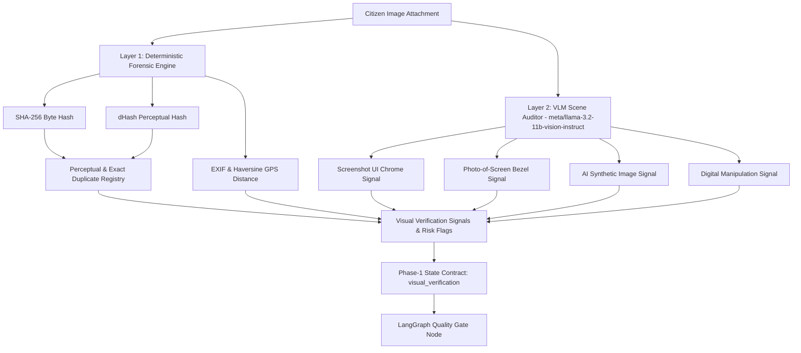

# Phase 1C — Visual Evidence Verification Engine Implementation Plan & Technical Summary

## Architecture & Security Boundary
The **Phase 1C Visual Evidence Verification Engine** refactors the legacy visual forensics agent into a multi-signal analysis engine operating on the principle of **Untrusted Citizen Evidence**.

---

## Technical Specifications & Features Implemented

### 1. Dual-Layer Forensics Architecture (`backend/agents/forensics.py`)
- **Deterministic Engine**:
  - **SHA-256 Hashing**: Exact byte duplicate detection.
  - **dHash Perceptual Hashing**: 64-bit difference hash calculation and Hamming distance lookup against `PerceptualDuplicateRegistry` (threshold $\le 10$ bits).
  - **EXIF & Haversine Distance**: Safe extraction of EXIF tags (Make, Model, DateTime, GPSInfo) and great-circle distance comparison against report submission coordinates ($\le 5.0\text{ km}$ threshold).
- **VLM Multimodal Engine**:
  - **Target Vision Model**: NVIDIA NIM `meta/llama-3.2-11b-vision-instruct`.
  - **Structured Pydantic Contract**: `VisualVerificationVLMOutput` validating visual evidence support, screenshot chrome, display screen photo, synthetic AI artifacts, and digital manipulation.
  - **Prompt Instruction Isolation**: Framed with strict `<CITIZEN_DESCRIPTION>` and `<CITIZEN_IMAGE>` boundaries to neutralize adversarial text contained within image frames or report descriptions.

### 2. Provider Fail-Safe Protocol
- If NVIDIA NIM vision API experiences timeouts or network errors, `ForensicsAgent` defaults to:
  - `analysis_status: "UNAVAILABLE"`
  - `supports_report: None`
  - `evidence_confidence: None`
  - `risk_flags: ["visual_service_failure"]`
- The downstream `Quality Gate` interprets `supports_report: None` as unknown evidence and routes the report to `PENDING_MANUAL_REVIEW`, guaranteeing no report is ever automatically rejected due to AI service downtime.

### 3. Verification & Compliance
- Executed full test suite containing 82 unit and pipeline integration tests (`backend/tests/test_phase1c_visual.py`, `backend/tests/test_phase1b_safety.py`, `backend/tests/test_phase1a_pipeline.py`, `backend/tests/test_ai_pipeline.py`).
- Pass rate: **100% (82/82 PASSED)**.
