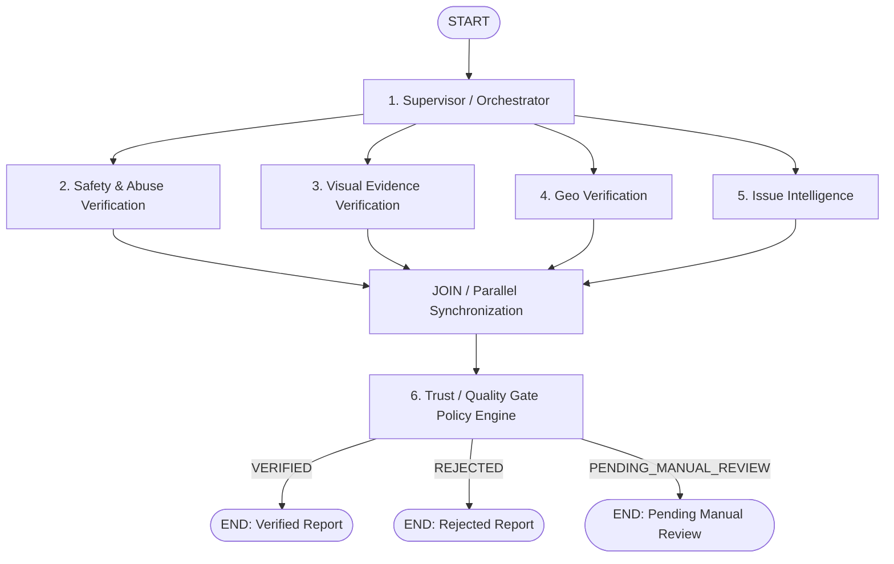

# AGENTS.md — Phase-1 Multi-Agent System Specification

> **Document Status**: Authoritative Specification for Phase-1 AI Agents (FROZEN).  
> **Architecture Target**: Phase 1 — Report Verification Engine.  
> **Implementation Note**: This specification defines the target agent contracts for the Phase-1 refactor. The legacy implementation (`backend/agents/pipeline.py`) currently uses an 8-node workflow with external Quality Gate logic.

---

# 1. System Purpose & Core Objective

The **Phase-1 Report Verification Engine** validates citizen submissions to answer:
> *"Can CivicConnect safely trust, understand, geographically validate, and accept this individual citizen report?"*

---

# 2. Pipeline Scope & Phase Lifecycle

- **PHASE 1: Report Verification Engine** (Target of current refactor): Validates an individual citizen report and emits a `verification_decision` (`VERIFIED`, `REJECTED`, or `PENDING_MANUAL_REVIEW`) with `pipeline_status = "COMPLETED"`. Phase 1 ends upon reaching this decision.
- **PHASE 2: Incident Intelligence** (FUTURE — Not implemented in Phase 1): Groups verified reports into civic incidents using configurable spatial candidate search, semantic/visual similarity, temporal context, civic-asset context, and corroboration.
- **PHASE 3: Municipal Action** (FUTURE — Not implemented in Phase 1): Smart department routing, SLA target management, officer assignments, enhancement notes, and citizen notifications.

---

# 3. Target Phase-1 Graph Architecture

> **Execution Note on Synchronization**: In the flow diagram below, `JOIN` represents LangGraph fan-in/synchronization semantics and is not an AI agent or business decision component.



---

# 4. Data Representation & Data Handling Rules

To protect source evidence and citizen privacy, three distinct representations are maintained:

1. **Original Report**: Preserved intact according to project data retention and security policy. The Supervisor must **NEVER** silently mutate or destroy original citizen evidence.
2. **AI-Safe / Processing Representation**: Unnecessary sensitive information (phones, emails, citizen PII) is masked/tokenized before sending text to external LLM models.
3. **Audit Representation**: Sensitive values are masked, tokenized, or hashed where appropriate before audit persistence.

---

# 5. Shared State Contract (`PipelineSharedState`)

All agents communicate through shared workflow state.

### Disambiguation of Workflow Status vs Decision
- `pipeline_status`: Operational graph execution status (`PROCESSING`, `COMPLETED`, `FAILED`).
- `verification_decision`: Final Quality Gate verification outcome (`VERIFIED`, `REJECTED`, `PENDING_MANUAL_REVIEW`).

```python
def merge_agent_outputs(
    left: dict[str, Any] | None, right: dict[str, Any] | None
) -> dict[str, Any]:
    merged: dict[str, Any] = dict(left) if left else {}
    if right:
        merged.update(right)
    return merged

class PipelineSharedState(TypedDict, total=False):
    report_id: str
    trace_id: str
    workflow_run_id: str
    citizen_id: str
    raw_payload: dict[str, Any]
    sanitised_text: str
    agent_outputs: Annotated[dict[str, Any], merge_agent_outputs]
    pipeline_status: str  # PROCESSING, COMPLETED, FAILED
    verification_decision: str  # VERIFIED, REJECTED, PENDING_MANUAL_REVIEW
    error: str | None
    metadata: dict[str, Any]
```

### Component State Permissions

| Agent Component | Read Access | Write Access (in `agent_outputs`) |
| :--- | :--- | :--- |
| **Supervisor** | `raw_payload`, `report_id` | `sanitised_text`, `pipeline_status`, `supervisor` |
| **Safety & Abuse** | `sanitised_text`, `raw_payload` | `safety` |
| **Visual Verification** | `raw_payload` (media URLs), `sanitised_text` | `visual_verification` |
| **Geo Verification** | `raw_payload` (lat, lon) | `geo_validation` |
| **Issue Intelligence** | `sanitised_text`, `raw_payload` | `issue_intelligence` |
| **Trust / Quality Gate** | `agent_outputs` (all component results) | `quality_gate`, `verification_decision`, `pipeline_status` |

---

# 6. Component Contracts

## 1. Supervisor / Orchestrator
- **Type**: Deterministic Orchestration Node.
- **Input**: Raw report submission payload.
- **Output Key**: `agent_outputs["supervisor"]`
- **Contract**:
  - Preserves original report evidence intact.
  - Prepares AI-safe representation (`sanitised_text`).
  - Initializes `report_id`, `trace_id`, and `workflow_run_id`.
  - Sets `pipeline_status = "PROCESSING"`.

---

## 2. Safety & Abuse Verification
- **Type**: Hybrid LLM + Precompiled Regex Security Node.
- **Input Key**: `sanitised_text`
- **Output Key**: `agent_outputs["safety"]`
- **Security Rule**: Citizen description text is **UNTRUSTED DATA**. It must never be injected as trusted system instructions.
- **Output Contract**:
  ```json
  {
    "clean": true,
    "flags": [],
    "toxicity_score": 0.02,
    "injection_detected": false,
    "confidence": 0.98
  }
  ```

---

## 3. Visual Evidence Verification
- **Type**: Dual-Layer Analysis Node (VLM Visual Understanding + Forensic Technical Signal Extraction).
- **Input Key**: `raw_payload["media_urls"]`, `sanitised_text`
- **Output Key**: `agent_outputs["visual_verification"]`
- **Security Principles**:
  - **Citizen Images = UNTRUSTED EVIDENCE**. Image presence does not equal image authenticity.
  - **Valid EXIF Metadata != Real-world Scene Proven**. Camera EXIF proves file capture properties; it does not prove the photographed subject was the actual physical civic problem.
  - **No EXIF Metadata != Fake Image**. EXIF stripped by messaging apps or browsers is a single neutral signal, never an automatic rejection rule.
  - **Visual Verification does NOT claim absolute authenticity**. Visual Verification outputs `supports_report`, `evidence_confidence`, and `signals`. It **NEVER** returns an absolute `"authentic": true` or `"is_real": true` claim.
- **Output Contract**:
  ```json
  {
    "supports_report": true,
    "evidence_confidence": 0.90,
    "signals": {
      "screenshot_suspected": false,
      "photo_of_screen_suspected": false,
      "synthetic_image_suspected": false,
      "manipulation_suspected": false,
      "exif_present": true,
      "exif_gps_present": true,
      "gps_consistent": true,
      "exact_duplicate_found": false,
      "perceptual_duplicate_found": false
    },
    "risk_flags": []
  }
  ```

---

## 4. Geo Verification
- **Type**: Deterministic GIS Spatial Join Node.
- **Input Key**: `raw_payload["latitude"]`, `raw_payload["longitude"]`
- **Output Key**: `agent_outputs["geo_validation"]`
- **Source of Truth**: PostGIS `ST_Covers` queries over PMC municipal ward boundary geometries. LLMs are never used for geo boundaries.
- **Output Contract**:
  ```json
  {
    "boundary_matched": true,
    "ward_name": "Aundh-Baner",
    "zone_name": "Zone 1",
    "confidence": 0.99
  }
  ```

---

## 5. Issue Intelligence
- **Type**: Multilingual Classification LLM with Precompiled Scoring Fallback.
- **Input Key**: `sanitised_text`
- **Output Key**: `agent_outputs["issue_intelligence"]`
- **Taxonomy**: `ROADS`, `WATER`, `DRAIN`, `ELEC`, `HEALTH`, `SANIT`, `FIRE`, `BUILD`, `TRAFF`, `PARKS`, `ADMIN`.
- **Output Contract**:
  ```json
  {
    "category": "ROADS",
    "urgency": "high",
    "tags": ["pothole", "asphalt"],
    "public_safety_risk": false,
    "confidence": 0.95
  }
  ```

---

## 6. Trust / Quality Gate
- **Type**: In-Graph Deterministic Policy Decision Engine Node.
- **Input Key**: All sub-dictionaries inside `agent_outputs`.
- **Output Key**: `agent_outputs["quality_gate"]`
- **Rule**: The Trust / Quality Gate is the **ONLY** Phase-1 component that makes the final report verification decision. Safety, Visual, Geo, and Issue Intelligence provide signals to the Quality Gate.
- **Outcomes**:
  - `VERIFIED`: Report meets all trust, safety, spatial, and classification thresholds.
  - `REJECTED`: Report violates explicit rejection policy based on sufficiently strong safety, abuse, invalidity, or contradictory evidence signals.
  - `PENDING_MANUAL_REVIEW`: Report contains conflicting or low-confidence signals requiring human officer verification.

---

# 7. Immutable Audit Record Contract

Every agent execution produces an immutable record in `agent_executions`:

```text
report_id
  └── workflow_run_id
          ├── safety execution
          ├── visual execution
          ├── geo execution
          ├── issue execution
          └── quality gate execution
```

```json
{
  "report_id": "8da8950c-b9ae-453b-80bd-9b286f8230e4",
  "trace_id": "c9aeccbc-73d1-4a5f-a721-ac4068e5ba51",
  "workflow_run_id": "wfr_99a87b6c5d4e",
  "component_name": "visual_verification",
  "model_used": "nvidia-nim-vision-v1",
  "confidence": 0.90,
  "execution_duration_ms": 1420,
  "input_snapshot_hash": "a1b2c3d4e5...",
  "output_snapshot": {
    "supports_report": true,
    "evidence_confidence": 0.90,
    "signals": { "screenshot_suspected": false }
  },
  "status": "COMPLETED"
}
```

Audit records **MUST NEVER** store API keys, JWT tokens, passwords, OTPs, provider secrets, or raw unmasked citizen PII.

---

# 8. Comparison of Legacy Implementation vs Target Phase 1

| Feature | Legacy Implementation (`backend/agents/pipeline.py`) | Target Phase 1 |
| :--- | :--- | :--- |
| **Component Layout** | 8 legacy nodes (`supervisor`, `forensics`, `classifier`, `geo_validator`, `moderator`, `enhancer`, `router`, `notifier`) | 6 logical components (`supervisor`, `safety`, `visual`, `geo`, `issue_intelligence`, `quality_gate`) |
| **Quality Gate** | Imperative Python in `AIPipelineService` after graph execution | In-graph decision node routing directly to `END` as sole decision authority |
| **Visual Output Contract** | Uses absolute claims (`"authentic": true`) | Produces evidence signals (`supports_report`, `signals`, `evidence_confidence`) |
| **Downstream Tasks** | Enhancer, Router, Notifier execute inside graph | Enhancer, Router, Notifier separated into downstream Phase 2 / Phase 3 services |